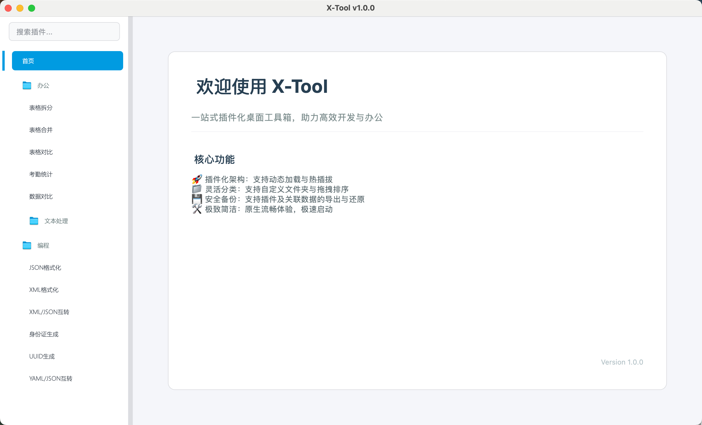
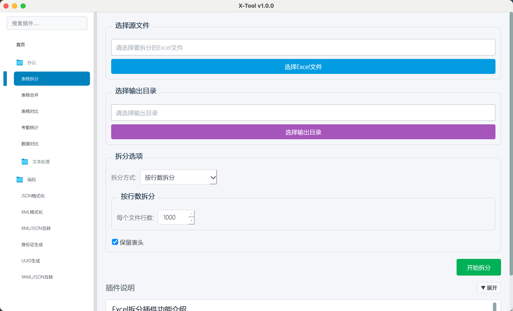

# X-Tool 桌面工具箱

一个基于 **PyQt6** 的高性能、插件化桌面软件框架。支持插件动态加载、热插拔及完整的依赖管理，旨在为开发者提供一个极致简洁且功能强大的工具集成平台。

---

## 🌟 核心特性

- 🧩 **插件化架构**：支持 Python 插件动态加载与热插拔，无需重启软件。
- 📦 **依赖隔离**：完整的 `.xpkg` 插件包方案，支持 lib 依赖与插件数据同步导入导出。
- 📂 **灵活管理**：支持自定义文件夹分类，左侧工具栏支持模糊搜索与即时定位。
- 🔄 **备份恢复**：提供一键备份/恢复功能，保障插件与配置数据的安全迁移。
- 🎨 **极致简洁**：采用浅色现代 UI 风格，原生流畅，极速启动。

## 🛠️ 技术栈

- **核心语言**: Python 3.9+
- **界面框架**: PyQt6
- **数据存储**: SQLite3
- **构建工具**: PyInstaller

## 🚀 快速启动

### 1. 环境准备
```bash
# 克隆项目
git clone https://github.com/cyrilsun/x-tool.git
cd x-tool

# 创建并激活虚拟环境
python -m venv venv
source venv/bin/activate  # macOS/Linux
# venv\Scripts\activate  # Windows
```

### 2. 安装依赖
```bash
pip install -r requirements.txt
```

### 3. 安装插件依赖
如果需要运行包含第三方库（如 `openai`, `requests`）的插件，请执行：
```bash
chmod +x install_plugin_deps.sh
./install_plugin_deps.sh
```

### 4. 运行项目
```bash
python main.py
```

## 🔌 插件开发

在 `plugins` 目录下创建独立的 `.py` 文件即可快速扩展。

### 基础结构示例：
```python
from PyQt6.QtWidgets import QVBoxLayout, QLabel, QPushButton
from src.plugins.base_plugin import BasePlugin

class MyPlugin(BasePlugin):
    def __init__(self):
        # 参数：插件名称, 描述, 作者, 版本
        super().__init__("我的插件", "插件功能描述")
        self._setup_ui()

    def _setup_ui(self):
        layout = QVBoxLayout(self)
        self.label = QLabel("这是我的新插件内容")
        layout.addWidget(self.label)

        btn = QPushButton("点击测试")
        btn.clicked.connect(self.on_click)
        layout.addWidget(btn)

    def on_click(self):
        self.label.setText("按钮已被点击！")

    def on_activate(self):
        print("插件已激活")

    def on_deactivate(self):
        print("插件已停用")
```

## 📸 软件截图

| 主界面 | 插件导入 |
| :---: | :---: |
|  |  |

---


